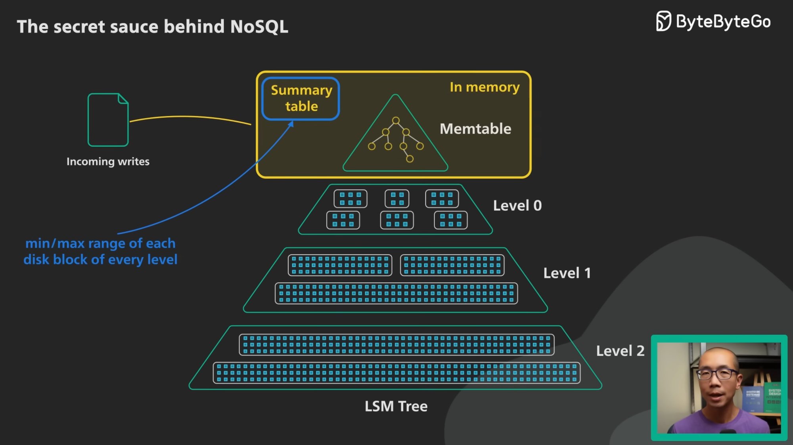
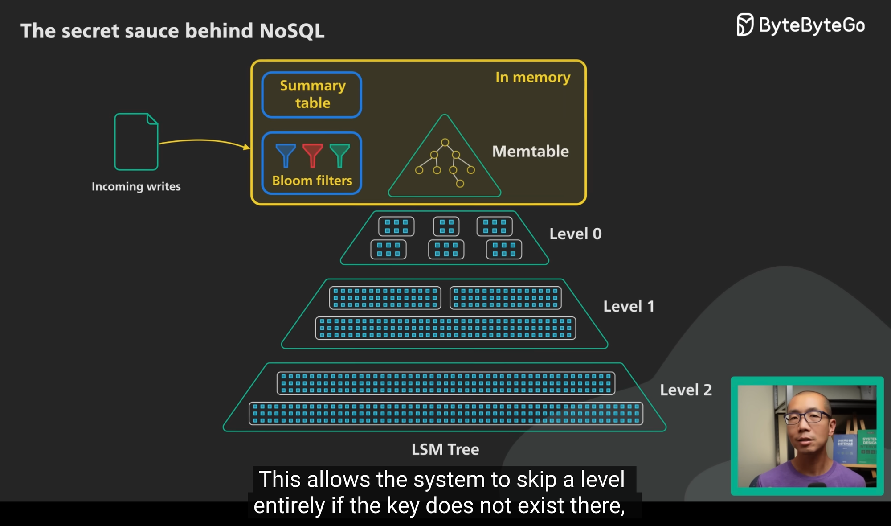

# 제목 없음

## 데이터베이스가 사용하는 데이터 구조

### 로그 쌓기

- 키-값으로 데이터 저장
- 데이터를 쌓기만함
- read & insert only
- 읽기 성능: O(n)
- 쓰기 성능: O(1)

💡 **읽기 성능이 너무 느림**

### 해시 색인

- 로그 쌓기 진행 후, <키-키 값의 위치(바이트 오프셋)>을 해시맵에 저장 하는 방법
- 인메모리 해시맵 사용
- 비트캐스크(Bitcask)(리악(Riak)의 기본 저장소 엔진)이 사용
- 키 값이 적고 업데이트가 많을 때 자주 사용
- 추가 전용 로그의 이점
    - DISK I/O 특성상 삽입이 빠름
    - 세그먼트 파일이 <삽입 전용 & 불변>이면 동시성과 고장 복구는 훨씬 간단
        - 이전 값 부분과 새로운 값 부분을 함께 남겨 두기 때문(언두 로그) → 아웃 박스 패턴과 비슷할 수도?
            - 분산 DB의 데이터 최종 일관성 보장 하는 패턴
    - 오래된 세그먼트 병합은 데이터 조각화를 방지할 수 있음
- 단점
    - 해시 테이블은 메모리에 저장하므로, 키가 너무 많아지면 비효율적
    - 범위 질의에 효율적이지 않음

💡 **시간 지날 시 디스크 공간 부족 문제 발생**
- 세그먼트로 로그를 나누는 방식으로 해결 가능
- 세그먼트가 일정 이상 크기가 된다면 쓰기 닫기 & 읽기만 진행
- 새로운 세그먼트로 이전 세그먼트의 최신 키 값만 옮김

### SS테이블

- Sorted string table
- 키가 정렬된 채로 로그가 쌓여진 형태
- 장점
    1. 세그먼트 병합 시 병합 정렬 작동하여 효율적
    2. 모든 해시 색인을 유지할 필요가 없음. 일부 해시 색인만 유지해도 나머지는 그 사이를 탐색하면됨
    3. 정렬된 해시 색인 간의 구간을 압축해서 데이터 저장을 할 수 있음
- 데이터를 키로 정렬하는 방법
    - AVL or 레드 블랙 트리 등을 이용하여 인메모리에서 먼저 key를 정렬
    - 트리가 일정 크기 이상이 됐을 경우, 디스크에 저장 → 로그 쌓기 형식이기에 빠름
    - 트리가 인메모리에 저장되기에, 서버 다운을 고려하여 백업용 로그도 같이 쌓음

### LSM Tree(Log-Structured Merge-Tree)

- 정렬된 파일 병합과 컴팩션 원리를 기반으로 하는 저장소 엔진
- 로그 쌓기 방법을 사용하기에 쓰기 성능이 좋음 → NoSQL에 주로 사용
    
    [The Secret Sauce Behind NoSQL: LSM Tree](https://www.youtube.com/watch?v=I6jB0nM9SKU)
    
- 정렬된 세그먼트 파일들에 대한 처음과 끝의 포인터를 해시 인덱스로 가지는 자료구조를 사용하여 검색 성능 향상
    
    

💡 **존재하지 않는 키를 찾는 경우**
- 맴테이블을 확인한 다음 키가 존재하지 않는다는 사실을 확인하기 전까진 가장 오래된 세그먼트까지 거슬러 올라가야함

### 블룸 필터(Bloom filter)

- 특정 원소가 집합에 속하는지 확인하는데 사용되는 자료구조
- 해당 원소가 확률적으로 있거나 아예 없는 것을 보장
- **순서**
    1. 원소를 여러 해시 함수에 대응시켜 비트 값(1)을 얻어냄. 
    2. 해당 비트 값들을 배열 인덱스에 작성.
    3. 특정 원소의 존재 가능성을 확인하고 싶을 경우, 여러 해시 함수에 원소를 태운 후 그 결과 값들이 배열 인덱스에 이미 존재하는지 확인하면 됨.
- 단점
    - 블룸 필터는 삭제를 지원하지 않음😢
        
        ‘매 계층 마다 블룸 필터를 새로 생성’ + ‘삭제는 또다른 기록’을 이용하여 해결
        
        - 매 계층에서 SSTable 병합할 때 삭제된 데이터는 제거
        - 예시
            - Level2에 id=1 존재
            - Level0에 id=1 삭제 시킴.
                - <id=1 → 삭제> 기록됨
            - Level0에서 SSTable 병합이 일어나서 Level1으로 새로운 블룸 필터가 만들어질 때 블룸 필터에는 id=1는 존재하지 않음. 따라서 Level2에 있는 id=1이 검색될 일은 없고, 블룸 필터 또한 삭제를 고려하여 최신화 되는 것 처럼 동작.

        